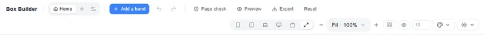
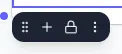
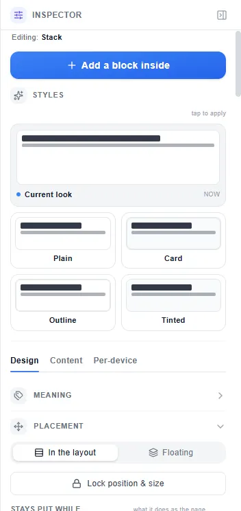
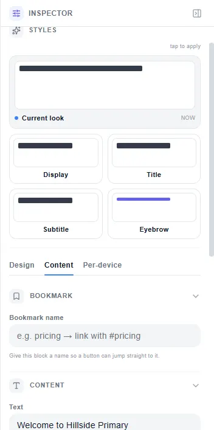
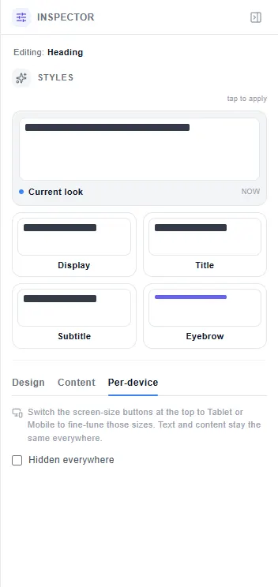
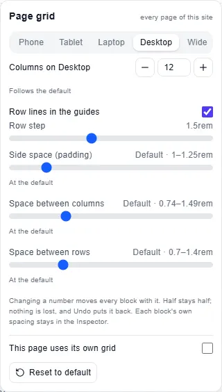

# Layout — reference

This is the control-by-control reference for the builder's layout panels. For scenarios and explanations see
[Layout — the story](/).

Controls are grouped by where they live. A control that appears in more than one block type is described once and
cross-referenced.

---

## Top bar

On a screen narrower than 1,600px, **Add a band**, **Page check**, **Preview**, **Export** and **Reset** show only
their icons (+, shield, eye, download, a turning arrow), so the bar stays one row on a 1280px desktop. (On a touch screen every button is a finger's size, 44px, so there the bar is
one row from 1,366px and two rows at 1,280px, with the words from 1,800px.) Each keeps its
name as a tooltip and for screen readers.

| Control | What it does | Shortcut |
|---------|-------------|---------|
| **Page tabs** (Home · **+** Add page · Page settings) | Switch between the site's pages, add one, rename or delete one. The page's menu also has **Line up with the grid** (every block of this page to the nearest whole column, on the screen you are editing; blocks placed free stay put; one Undo) and **Page grid…** | — |
| **+ Add a band** | Adds a full-width band at the bottom of the page; you can drag it to any position after. | — |
| **Undo** | Reverses the last change. | Ctrl / Cmd Z |
| **Redo** | Re-applies the last undone change. | Ctrl / Cmd Y, or Ctrl / Cmd Shift Z |
| **Page check** | Lists what to fix before publishing: pictures missing a description, heading levels out of order, lines too tight for their words. The badge counts them. | — |
| **Preview** | Opens the real published page. Close it with **Exit preview**; **H** hides the Preview's own controls. | — |
| **Export** | Downloads `site.zip`: one HTML file per page and a shared `styles.css`, with your fonts and uploaded pictures inside them. | — |
| **Reset** | Starts the whole site over — every page replaced by one blank page. It asks first, and Undo puts the site back. | — |
| **Device chips** (Mobile 375 · Tablet 768 · Laptop 1024 · Desktop 1280 · Wide 1920 · Full width) | Switches the canvas to that screen. At Desktop or Full width you edit the base design (Full width draws the desktop page, 1200px wide, shrunk to fit the room, so what you see is what you edit on any screen); a change at Mobile, Tablet or Laptop applies from that screen down; Wide keeps its own. | — |
| **Zoom** (− · Fit · +) | Zooms the canvas; **Fit** fits the whole page width in the window. | — |
| **Layout guides** (the grid icon) | Draws the page grid's column and row lines over the canvas, and opens the **Page grid** panel. | — |
| **Show hidden blocks** (the eye) | Draws blocks hidden at this screen faintly, so you can select and edit them. Click again to hide them. | — |
| **Base size** (the number box, 10 by default) | The size in px everything on the canvas scales from, so words stay readable when you zoom. | — |
| **Website theme** (the palette) and **Editor appearance** (the sun) | The site's own colours and type, saved with it · the builder's light / dark look, for you only. | — |
| **Blocks** (the button at the canvas's left) | Opens or closes the Blocks panel — docked at the side on a laptop or larger, floating over the canvas on a smaller screen. | **B** |

---

## Blocks panel

Drag a tile onto the page and let go where the dashed marker shows, or click a tile to add it after the selected block.

| Section | Block | What it makes |
|---------|-------|--------------|
| **Layout** | Stack | Things one under another. |
| | Side by side | Things in a row. |
| | Grid | Things across and down, sized like a table insert (sweep across × down). |
| | Spacer | Adjustable blank space. |
| | Divider | A horizontal rule (solid, dashed, dotted). |
| | Hero | One full-screen photograph with headline. |
| | Rotating hero | Several full-screen photographs in turn. |
| **Text** | Heading | Titles — Display, Title, Subtitle, Eyebrow styles. |
| | Text | Paragraphs — Body, Lead, Caption, Quote styles. |
| | Button | A call-to-action link. |
| | List | Bulleted or numbered. |
| **Media** | Image | One photograph or image. |
| | Photo gallery | Many photographs at once, set up in one dialog. |
| | Slider | Photographs shown one at a time with dots. |
| | Video | YouTube, Vimeo, or MP4. |
| | Icon | A searchable symbol (inline SVG). |
| | Embed | Raw iframe or HTML pasted in. |
| **Components** | Accordion | Expandable Q&A. |
| | Alert | One urgent message (closure notice, open day…). |
| | Card | Image + heading + text + button. |
| | Quote | Testimonial with author. |
| | Stat | Big number + label. |
| | Badge | Small pill label. |
| | Rating | Star rating display. |
| | Pricing | Pricing plan card. |

---

## Block toolbar

Appears just above (or below) the selected block.

| Button | What it does | Shortcut |
|--------|-------------|---------|
| **⠿ Drag to move** | Hold and drag the block to a new place; let go where the dashed marker shows. Works with a finger too; on a touch screen you can also hold the block itself still for half a second to lift it. | — |
| **+ Add a block inside** | Nests a new block inside this one. | — |
| **🔒 Lock position and size** | Freezes the block's place and size; click again to unlock. | — |
| **⋮ Block actions** | The menu below. | — |

The **⋮ Block actions** menu:

| Item | What it does | Shortcut |
|------|-------------|---------|
| **Move up** / **Move down** | One place earlier / later in its container. | ↑ / ↓ |
| **Duplicate** | An identical copy directly after it. | Ctrl / Cmd D |
| **Copy** · **Cut** · **Paste** | The usual clipboard, for blocks. | Ctrl / Cmd C · X · V |
| **Delete** | Removes the block and everything inside it. | Delete / Backspace |
| **Float on top** / **Return to flow** | Lifts the block out of the layout to place it freely, or puts it back. | — |
| **Bring to front** · **Bring forward** · **Send backward** · **Send to back** | Layer order of floating blocks. | — |
| **Ungroup** | Takes the blocks out of a group. | Ctrl / Cmd Shift G |

Click a block to select it; click again to go inside it; **Escape** steps back out one level.

---

## Inspector — Design tab

Above the three tabs, **Styles** shows ready-made looks for the selected block as live previews; tap one to apply it.

### Arrange (Stack / Side by side / Grid only)

Stack, Side by side and Grid are one block in three arrangements; these switch between them without losing what is
inside.

| Control | What it does |
|---------|-------------|
| **Direction**: Top-to-bottom · Side-by-side | A Stack (blocks down the page) or a row (blocks across it). |
| **Arrange as**: Free arrange · Grid | Free arrange follows Direction; Grid lays the blocks out across *and* down, in columns. |
| **Show one at a time** | Turns any container into a pager — children become pages, visitors swipe between them. |
| **Edge shape**: Top · Bottom — Straight · Slope right · Slope left · Curve out · Curve in | Cuts the band's top or bottom edge into a slope or a curve, shown as little pictures; **Edge depth** sets how deep. The shape cuts the background, never the size. |

### Size (every block)

| Control | What it does | Notes |
|---------|-------------|-------|
| **Width** | The block's share of its row, as a fraction (e.g. 3 of 6) or a fixed rem value. Drag the block's left or right edge to change it; the opposite edge stays fixed. | Per screen |
| **Columns (of 12)** (page-grid rows) | How many of the page's columns the block spans on this screen, in halves; the block beside it gives what this one takes. | Per screen · Alt ← / → (Shift: half) |
| **From line** (page-grid rows) | The column line where the block starts. Changing this moves the left edge; the right edge stays. | Per screen |
| **To line** (page-grid rows) | The column line where the block ends. Changing this moves the right edge; the left edge stays. | Per screen |
| **Whole line** (page-grid rows) | Spans every column on the current screen. Adapts if the column count changes. | Per screen |
| **To the last line** (page-grid rows) | Sets the right edge to the last column boundary, from wherever the left edge is. Adapts with column count. | Per screen |
| **Bleed to the page edge** (page-grid rows): Off · Left · Right · Both | Extends the block past the page's side space to the page's physical edge on that side. | Per screen |
| **Free inside its columns (% of them)** Left / Right (Alt-drag) | Fine position within the block's columns, as a percentage. Appears after an Alt-drag. | Per screen |
| **Back on the lines** (Alt-drag) | Snaps a free-positioned block back to its column boundaries. Clears the left / right margins. | — |
| **Rows tall** (page-grid rows) | How many grid rows this block spans. 1 is the default; 2 or more makes it cover multiple rows. | Per screen |
| **Height** | A minimum height for the block, in rem or px. Not available on all block types. | Per screen |
| **At least rows tall** (bands) | For a page-grid page's outer band — the band is at least this many row-heights tall. | Per screen |

### Placement

| Control | What it does |
|---------|-------------|
| **In the layout** (default) | The block takes its place in the page's normal layout. |
| **Floating** | The block is lifted off the layout; you drag it to any position. Other blocks ignore it. On a phone it goes back into the layout. |
| **Stays put while scrolling** | **Scrolls away** (default) · **Sticks when reached** (it keeps its own space and holds when it reaches the top) · **Floats on screen** (lifted off the page, held at an edge or corner of the window). |

### Meaning (semantic role)

| Control | What it does |
|---------|-------------|
| **Page header** | Wraps the block in `<header>`. |
| **Navigation** | Wraps the block in `<nav>`. |
| **Main content** | Wraps the block in `<main>`. |
| **Sidebar** | Wraps the block in `<aside>`. |
| **Page footer** | Wraps the block in `<footer>`. |
| **Heading level** | For Heading blocks — the h1 / h2 / h3 / h4 level in the published HTML. |

### Spacing

| Control | What it does | Notes |
|---------|-------------|-------|
| **Space between blocks** | The space between the blocks inside this container, across and down at once. A slider. Default is about 1rem. | Per screen |
| **Space across** · **Space down** | The same space, across and down separately — "same as above" until you move one. | Per screen |
| **Space between columns** (page-grid rows) | The gap between blocks side by side in a page-grid row (across). | Per screen |
| **Space between rows** (page-grid rows) | The gap between wrapped lines of a page-grid row (down). | Per screen |
| **Inner spacing** (padding) | Space between the block's edge and its content, all sides at once or each side separately. Shows "Default · …rem" and a **Back to default** button. | Per screen |
| **Outer spacing** (margin) | Space outside the block's edge, all sides at once or each side separately. Shows "Default · …rem" and a **Back to default** button. | Per screen |

*Every spacing control that shows "Default · …rem" means the value is the builder's default and can be returned to it
with **Back to default**. The default is never zero unless you set it to zero.*

### Background

| Control | What it does |
|---------|-------------|
| **Colour** | Fills the block with a solid colour from the site's design tokens (or a custom hex / OKLCH value). |
| **Gradient** | A gradient between two or more colours, with direction. |
| **Image** | An uploaded photograph or pattern as a background. |
| **Overlay** | A semi-transparent colour layer over a background image (to keep words readable). Strength: 0–100%. |
| **Pattern / Grain** | A noise or grid texture over the background. |

### Shadow, Border, Radius

| Control | What it does |
|---------|-------------|
| **Shadow** | Adds a drop shadow: size, blur, spread, colour. |
| **Border** | A visible outline: width, style, colour. |
| **Corner radius** | Rounds one or all corners independently, in rem. |

---

## Inspector — Content tab

(Available on Text, Heading, Button, Image, List, and component blocks.)

| Control | What it does |
|---------|-------------|
| **Text / Label** | The editable text for this block. Click the block on the canvas to edit inline instead. |
| **Link** | For Button and Heading — the URL the block links to (a page name, or a full URL). |
| **Describe this image** | The alt text for an Image block. Read aloud to users who cannot see it. |
| **Load straight away** | Turns off lazy loading for an Image — use only for images at the very top of the page. |
| **Show the whole picture (don't crop it)** | Ticked: the block takes the photograph's own proportions. Unticked: crops to the Height you set. |
| **Fill the block's height** | Shown only for an Image that is the only thing in a block spanning 2 or more rows. On (the default): the picture fills the block's whole height, cropped from its centre, never stretched and never shorter than its own height. Off: it keeps its own height. Per screen, like **Rows tall**. |
| **Bookmark** | An anchor name — the block can be linked to directly using `#bookmark`. |

---

## Inspector — Per-device tab

| Control | What it does |
|---------|-------------|
| **Hidden on phone** (the name follows the device chip: phone, tablet…) | The block is gone at that screen — no space taken, nothing moved — on the canvas and on the published page. **Show hidden blocks** (the eye in the top bar) draws it faintly so you can select it. |
| **Hidden everywhere** | Hides the block on every screen; tick it, then untick "Hidden on phone" at the Mobile chip to show it on phones only. |
| The yellow note "Editing Phone…" | Says which screen your size, spacing and layout changes apply to, with **Reset phone changes to default**. |

---

## Page grid panel

Opened by the **Layout guides** button in the top bar (the grid icon), or right-click the canvas → **Page grid…**.

| Control | What it does | Notes |
|---------|-------------|-------|
| **Phone · Tablet · Laptop · Desktop · Wide** | Which screen the settings below are for. | — |
| **Columns on …** (− / number / +) | The number of columns on that screen. Default 12 from a tablet up, 6 on a phone. Every block keeps its share (half stays half); Undo puts it back. | Per screen |
| **Row lines in the guides** | Draws the row lines as well as the column lines. | — |
| **Row step** | The height of one grid row (default 1.5rem) — what **Rows tall** counts in. | — |
| **Side space (padding)** | Breathing room on all four page edges. Default 1–1.25rem (1rem on a phone, growing to 1.25rem wide). 0 puts every block against the page edge. | All four sides |
| **Space between columns** | Gap between blocks side by side (across). Default about 0.75–1.5rem. | Per screen |
| **Space between rows** | Gap between wrapped lines (down). Default about 0.7–1.4rem. | Per screen |
| **This page uses its own grid** | The settings above apply to this page only; unticked, they are shared by every page of the site. | — |
| **Reset to default** | Puts every setting in the panel back to its default. | — |

Each setting reads "At the default" or "Follows the default" until you change it.

---

## Keyboard shortcuts (complete list for layout)

| Key | What it does |
|-----|-------------|
| **B** | Open / close the Blocks panel |
| **Ctrl / Cmd Z** | Undo |
| **Ctrl / Cmd Y** or **Ctrl / Cmd Shift Z** | Redo |
| **Ctrl / Cmd D** | Duplicate selected block |
| **Ctrl / Cmd C · X · V** | Copy · cut · paste a block |
| **Ctrl / Cmd G** · **Ctrl / Cmd Shift G** | Group the selected blocks · Ungroup |
| **Ctrl / Cmd L** | Lock or unlock the selected blocks' position and size |
| **Alt F** | Float the block, or put it back in the layout |
| **Ctrl / Cmd ]** · **[** (Shift: to the front / back) | Bring a floating block forward · send it back |
| **Shift G** | Layout guides on / off (not while you are typing) |
| **Alt ← / →** (Shift: half) | A block of a page-grid row takes one column more / fewer, said aloud ("5 of 12 columns") |
| **Enter** or **F2** | Start typing in the selected block |
| **Delete / Backspace** | Delete selected block |
| **Escape** | Step out to the parent block; close the Blocks panel, a menu, or the Inspector (below laptop width) |
| **Tab** | Move focus to the next interactive element |
| **Shift + drag edge** | Snap to half-column lines (page-grid rows) |
| **Alt + drop / drag edge** | Free-position inside columns (page-grid rows) |
| **↑ / ↓** (block selected) | Move a block in the layout one place earlier / later |
| **↑ ↓ ← →** (floating block) | Nudge it 2px (12px with Shift) |
| **H** (in Preview) | Hide or show the Preview's own controls |

---

## How controls change per screen

Many controls are **per screen**: the value you set at Desktop applies to Desktop only; the value at Mobile applies
to Mobile only. The cascade works like CSS: a value set at a wider screen applies to narrower screens too, unless
you override it at that narrower screen. **Wide is the exception** — it branches off Desktop, so what you set at Wide
stays on big screens and never reaches the narrower ones.

The device chip in the top bar shows which screen you are editing. The Inspector labels a control "(per screen)"
when it supports this. Controls without that label apply to all screens equally.

---

*See also:* [Layout — the story](/) for scenarios and explanations · [Website Builder](website-builder) for
content blocks, media, components, themes, Preview and export.
