# Laying out a page — the story

This is the documentation you read first. It is not a manual and not a list of controls: it walks through what a
person wants on a page, what they do, what they see on every screen, and why the builder behaves as it does. The
reference guide ([Layout — reference](layout-reference)) has every control; this has the reasons and the examples.
It grows: every time an area of the layout is finished, its story is added here.

The one idea behind everything: **you build a page out of boxes, and every box knows how to behave on a phone, a
tablet and a desktop without you telling it.** You decide *what goes where*; the builder decides *how it fits*.

---

## 1. The three shapes, and the band

Maya is putting together the Year 6 page. She opens the Blocks panel and sees three ways to hold things:

- **Stack** — things one under another. A heading, then words, then a button.
- **Side by side** — things next to each other. A photo beside a paragraph.
- **Grid** — a table-like arrangement: three cards across, two rows of them.

[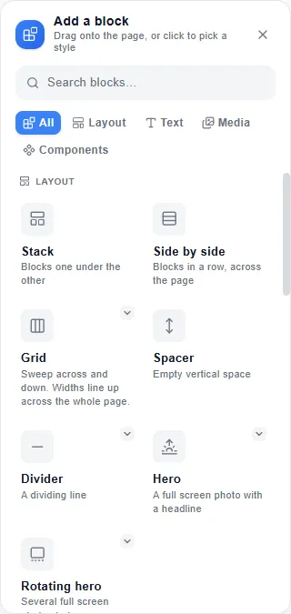](img/ref-blocks-panel.webp)

They are the same block in three arrangements, so nothing is a dead end: a stack can hold a row, a row's column can
hold a stack, and a grid cell can hold either. Every layout on every real site we studied is made of these three,
nested. (That is not a guess: 4,147 crawled pages, every one of them describable this way.)

Underneath, every block you drop on the page sits in a **band** — a full-width strip. You never see bands, but they
are why "put this beside that" and "put this under that" always land where you point: beside means the same band, under
means a new one.

**Edge to edge, or a centred column.** Select a band and choose *Edge to edge* (the colour runs to the window's edges
and so does the content) or *Centred column* (the colour still runs edge to edge, but the content is held to a
comfortable reading width in the middle). Maya's hero is edge to edge; her body text is a centred column, because 68
characters a line is what people can read.

## 2. "I want a photo beside my words"

Maya drops a **Text** block into her section, types her paragraph, then drags an **Image** tile and drops it on the
right edge of the text. The builder makes a row of two columns: words on the left, photo on the right, each half the
width.

She wants the photo smaller. She clicks the text column, grabs its right edge and drags it right. The boundary between
the two moves, the words widen, the photo narrows — **the edge you grab is the only thing that moves; the far edges
stay where they are.** She lets go at 60 / 40.

[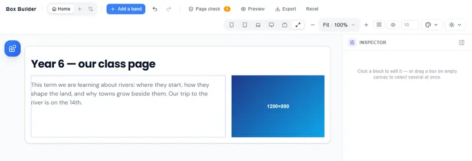](img/story-photo-beside-desktop.webp)

Now the screens:

- **Desktop and laptop:** 60 / 40, as she set it.
- **Tablet:** still 60 / 40 — two columns fit comfortably.
- **Phone:** the two stay side by side only while **both keep room**: the words about 14rem (224px) to read, and **every
  block — the photo too — at least 10rem (160px) of the page's columns**. At 60 / 40 on a 375px phone the photo's
  columns would be 150px, so it drops under the words and each takes the full width. (Pages saved before the page grid
  always stack on a phone.)

[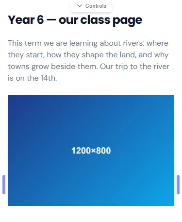](img/story-photo-beside-phone.webp)

:::tip[Want the photo beside the words on a phone anyway?]
Switch the device chip to **Mobile**, select each block and set its lines in Design → Size (**From line** / **To
line**). A width you set on the phone itself always wins there, so the row is drawn exactly as you set it. If the words
then get too tight, **Page check** says so.
:::

She did not set anything for the phone. Everything she changes at the Mobile chip applies from the phone size down
and nowhere else.

## 3. "Three cards across, that stack on a phone"

For the clubs, Maya wants three cards. She clicks **Grid**, sweeps *3 across, 1 down*, and gets three empty cells. She
drops a **Card** into each. The cells share the width equally; the cards grow to the tallest one so their buttons line
up.

[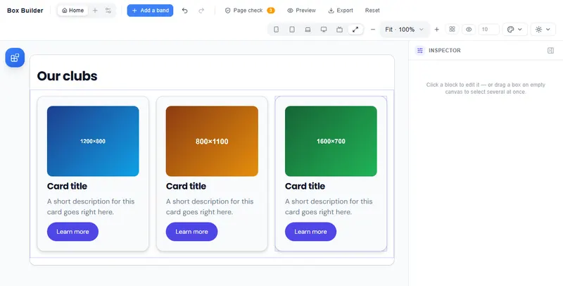](img/story-cards-desktop.webp)

- **Desktop, laptop:** three across.
- **Tablet (600–900px):** still three across — three cards at 250px each are perfectly readable, so the builder leaves
  them. (Four or more across *would* be rearranged to at most three a line on a tablet, as evenly as they can: 4 → 2 + 2,
  6 → 3 + 3.)
- **Phone:** one under another.

[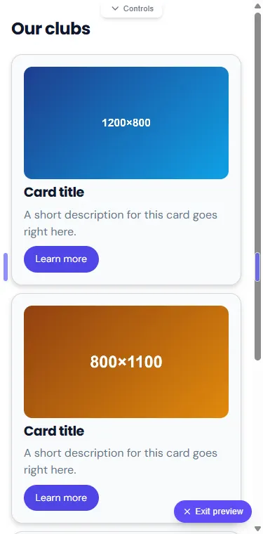](img/story-cards-phone.webp)

**The grid also watches its own box, not only the screen.** Later Maya puts a three-across grid of quotes *inside* the
middle card. That inner grid is now in a box a third of the page wide. On a laptop the screen has room for three
across, but the box does not — so the inner grid goes two across, and inside anything narrower than about 24rem it goes
to one. Nothing squeezes to a sliver, and no word is ever broken letter by letter.

**Any number across, and the numbers never break.** For the school's facts Maya sweeps *6 across* and drops a **Stat**
into each cell — "1,000+ pupils", "45 teachers"… On a wide screen there is room for all six, but beside the sidebar the
main column is narrower, and "1,000+" in big figures needs about 200px. So the grid gives up columns before it would ever
break the number — and it gives them up **evenly**: six become **3 + 3**, then **2 + 2 + 2**, never five with one left
alone underneath. A row of four Stats does the same (2 + 2).

**A small thing beside a tall one.** In "Meet the team" Maya puts a star icon in the first cell and a long quote in each
of the others. The star's cell is as tall as the quotes — the row stays lined up — but the star itself stays star-sized
at the top. She drags a **Text** from the blocks panel and lets go just under the star: it lands right there, one gap
below the star, in the same cell. The spare height of the cell goes to the last block, below its words, never into a hole
between the two.

## 4. "A sidebar that stays put"

The term-dates page has a long article and a short "In this section" list. Maya drops a Stack, puts the article in
it, then drops another Stack on its right edge for the sidebar, and drags the boundary to 70 / 30. She selects the
sidebar → Design → Placement → *Sticks when reached*, so it stays on screen while the article scrolls.

[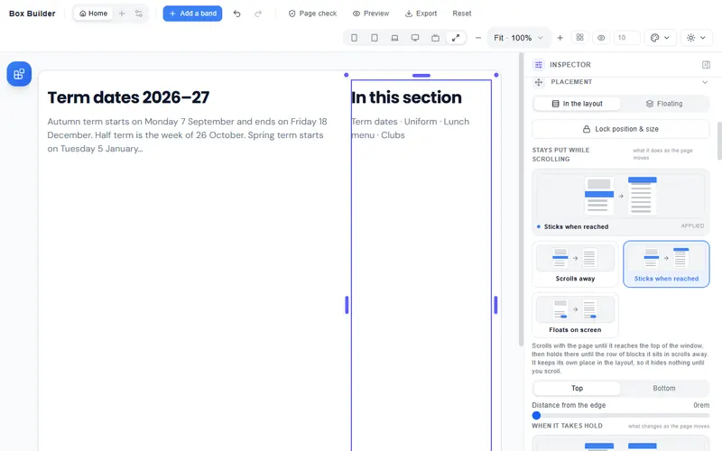](img/story-sidebar-desktop.webp)

- **Desktop, laptop, tablet landscape:** article and sidebar side by side, the sidebar holding its place as you scroll.
- **Phone:** like the photo in §2, every block of a row keeps at least 10rem (160px) of the page's columns on a phone.
  Her sidebar is 30 % — about 112px on a 375px phone — so it goes under the article, the full width, where its links
  are easy to tap.

[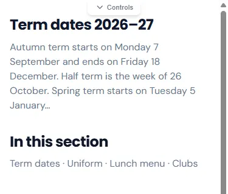](img/story-sidebar-phone.webp)

:::tip[A sidebar beside the article on a phone]
At the **Mobile** chip, set both blocks' lines in Design → Size (**From line** / **To line**). A width set on the phone
itself wins there; **Page check** warns if the words become too tight.
:::

Two things she marks under *Meaning*: the article column as **Main content**, the sidebar as **Sidebar**. That is what
makes the published page say `<main>` and `<aside>` to a screen reader; she never sees the tags.

## 5. Sizing by hand — and the one pixel of slack

When Maya sizes a column herself, that size is hers: "the size you drag is the size you get", and the builder never
quietly changes it. Two things protect that promise:

While she drags, a label beside the edge says where she is in columns — "8 of 12" on this screen, and what that
becomes on a phone:

[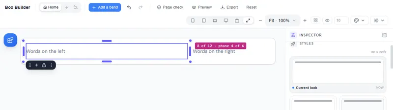](img/story-drag-edge.webp)

- **Nothing is drawn narrower than its longest word.** Drag a column to 3rem and it will still be as wide as the
  longest word in it, so words never break.
- **Every line that holds a hand-sized column has one pixel of slack.** A word that needed one pixel more than the
  column's share made the column one pixel wider, the row no longer fitted, and the neighbour dropped to the next
  line — a hole. The slack lives at the end of the line (the last column lends it), so no column changes size.

## 6. Hiding something on one device

The menu is a list of links on a desktop and a "☰ Menu" button on a phone. Maya switches to the **Mobile** chip,
selects the link list → *Per-device* → ticks **Hidden on phone**; then selects the button and hides it on every other
screen the same way.

[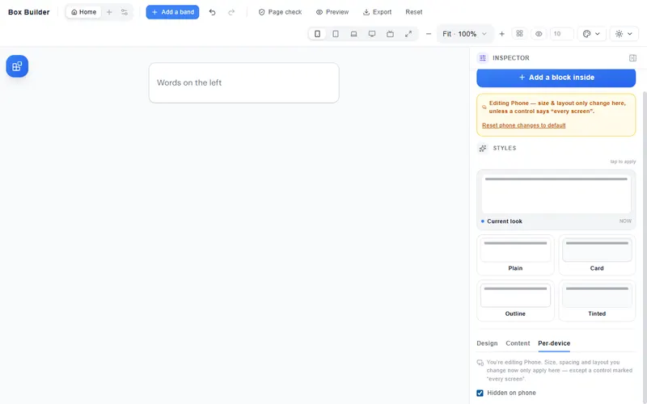](img/story-hide-mobile.webp)

**A hidden block is gone from that device — on the canvas as much as on the published page.** It takes no space and
moves nothing.

:::tip[Getting a hidden block back]
The **eye** beside the device chips (*Show hidden blocks*) draws hidden blocks faintly so you can select and edit them;
click it again and they are gone.
:::

## 6½. "My words never touch an edge" — space by default

I drop a Heading on an empty page. Its words sit a gutter in from both edges (about 2rem; a little less on a phone),
with a little space above and below — I never set any of it. I drop three Stacks beside each other and colour them: a
**1rem gap** runs between them, the first still starts at the page's left edge and the last ends at its right, and all
three stay on one line.

Every one of these is mine to change, down to zero: select the block, open **Spacing**, and each control says
"Default ·" and its value until I move it, with **Back to default** to undo my change. A heading's own default is 0 —
its gutter belongs to the section around it, so that is where it is changed.

A page I saved before these defaults existed opens exactly as it was.

[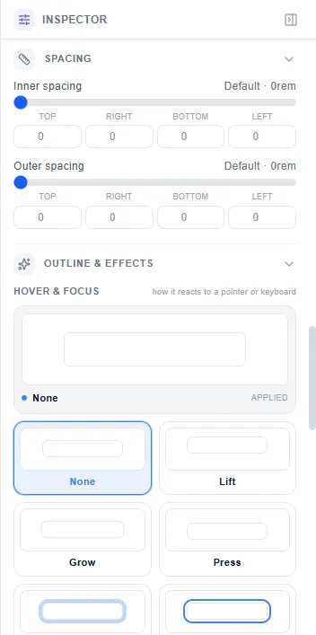](img/story-spacing-default.webp)

---

## 6¾. "The whole page is mine" — the page grid

*New pages from 4 October 2026.*

### What you see

Every page I add now sits on an invisible grid: twelve columns across from a tablet up, six on a phone, running from
one edge of the page to the other. I never see the grid itself. What I notice is that things line up: the photo in my
hero, the three cards under it and the stats under those all start and end on the same lines — about 1rem from the edges
of a phone and about 1.25rem on a wide screen.

The lines run gapless, edge to edge. The space between two blocks is centred on a line, not inside each block, so
**three cards side by side share one gap** (0.75rem on a phone, 1.5rem wide) rather than each carrying its own margin.

### Columns change per screen

The builder gives every screen its own column count:

| Screen | Default columns |
|--------|----------------|
| Phone (< 600px) | 6 |
| Tablet (600–900px) | 12 |
| Laptop (900–1200px) | 12 |
| Desktop (1200–1800px) | 12 |
| Wide (≥ 1800px) | 12 |

I can change any of these in the **Page grid** panel (the Layout guides button in the top bar, or right-click the
canvas → *Page grid…*). Adding more columns — say 16 for a fine
grid — divides the page into more, thinner slices. The blocks on the page keep their proportional share of the
column count.

### The guides

The **Layout guides** button in the top bar (the grid icon) draws the grid over the canvas: a line at every column
boundary, and faint row lines. It also opens the **Page grid** panel. A block snaps to the nearest line when I drag its
edge, so every edge lands on a line, not a pixel between two. The label on the selected card says how many columns it
covers.

[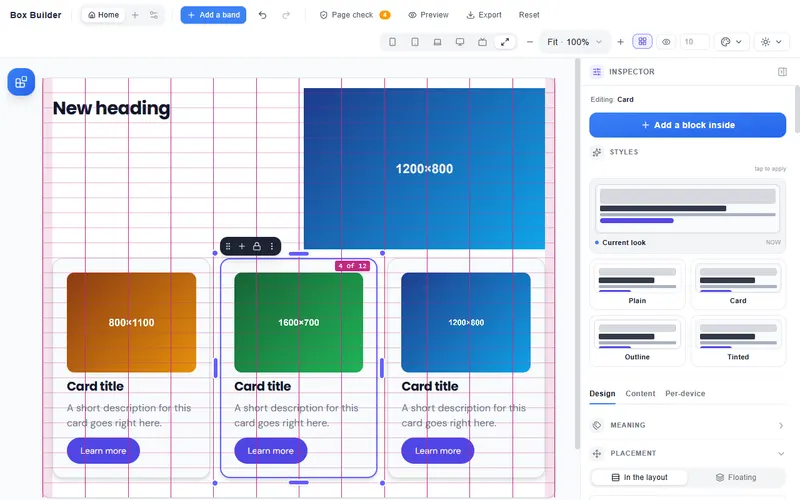](img/story-page-grid-guides.webp)

### Snapping and Shift-snap

Drag a block's edge and it snaps to the nearest column line. Hold **Shift** while dragging and it snaps to half-lines
too — the centre of a column. That lets me place a block that spans a column and a half, or a precise two-and-a-half.

:::tip[Shift for halves, Alt for free]
**Shift** while dragging an edge adds the half-lines. **Alt** lets the edge go anywhere inside its columns (below).
:::

**The far edge stays put.** When I drag a block's left edge right, its right edge does not move. When I drag the right
edge left, the left edge stays. This is "the edge you drag is the only edge that moves" — the same rule as resizing
any column, applied here to a block on the grid.

### Alt-drag: free inside the columns

Hold **Alt** while dropping a block (or dragging an existing block's edge) to place it freely instead of snapping to
lines. The block still "owns" the columns it lands on — its share of the grid's column count doesn't change — but
a margin inside its columns moves it to where you let go.

This is "Alt-free": the block covers the nearest columns and sits inside them with a margin. At every other screen
it keeps the same columns. A block in Alt mode shows "Free inside its columns (% of them)" Left / Right in the Size
section of the Inspector, with a **Back on the lines** button that snaps it back.

An **Alt-drag of a block's edge** runs the block's columns out to the nearest line beyond the pointer, with the
leftover distance as the free margin. So a small nudge adjusts the margin; a large drag extends to the next column
and adjusts the leftover.

An **Alt-drag of the whole block** (not an edge) **slides it** along its current line — between its neighbours, which
never move. The block does not lift to a free x / y position; it shifts left or right within the space the line has.

### "From line" and "To line"

Select a block and look at the **Size** section. Two controls appear: **From line** and **To line**. These are the
column lines where the block starts and ends — the same as dragging the edges, but typed as numbers.

Changing "From line" moves the left edge; the right edge stays. Changing "To line" moves the right edge; the left
edge stays. Both are per screen: set "From line 2" on Mobile and it applies only below 600px.

### Whole line, To the last line

**Whole line** makes a block span every column on its row — from line 1 to the last line on that screen. If I later
change the column count from 12 to 16, the block grows with it.

**To the last line** sets the block's right edge to the page's last column boundary on every screen. The block starts
where I placed its left edge; only its right end is pinned to the last line. It also adapts when the column count
changes.

### Bleed and half-bleed

A block can bleed past the page's side space to the page's physical edge, on either side or both:

- **Bleed left:** the block extends left to the edge of the page, ignoring the side space.
- **Bleed right:** same, on the right.
- **Bleed both:** edge to edge.

A block that bleeds on one side still keeps the side space on the other. A coloured band that bleeds both becomes a
true full-width stripe. These are also per screen: bleed on Desktop, not on Mobile.

**Half-bleed** (a block at the first or last column) means the block's outer edge sits at the page edge and the side
space is absorbed into its first/last column rather than appearing outside it.

### Space between columns and rows

Two controls in the **Page grid** panel:

- **Space between columns** (across): the gap between blocks side by side, from 0 to 4rem, default about 0.75–1.5rem
  depending on screen width. Guides and blocks move together when this changes.
- **Space between rows** (down): the gap between wrapped lines of a row, from 0 to 4rem, default same range.

Each has a **Back to default** button.

### Rows tall — spanning rows

A block in a page-grid row can be set to span multiple rows. Select it, go to **Size** → **Rows tall**, and pick 2
(or more). The block covers two row-heights; the blocks beside it each get their own row.

Where Maya has a gallery photo beside two paragraphs, she sets the photo's block to "Rows tall 2". The block covers the
height of both paragraph rows; the paragraphs sit one per row beside it. **When the picture is the only thing in that
block, it fills the block's whole height** — cropped from its centre, never stretched, and never shorter than its own
height. She can turn that off: select the picture → **Content** → **Fill the block's height**; then the picture keeps
its own height and the rest of the block is empty space. The switch only appears where it does something: a block
that spans one row, or a picture with words beside it in the same block, keeps the picture's own height.

**On a screen where the fit rule stacks the row** (words too tight to fit side by side), the span is automatically
dropped — the photo and the paragraphs each take their own line, the same as without the span, and the photo is its
own height again.

### The frame

Every page-grid page has a **side space** around it — a little breathing room on all four edges. By default this is
`clamp(1rem, …, 1.25rem)`: 1rem on a small phone, gently growing to about 1.25rem on a wide screen. It applies to
the page's top and bottom as well as its sides.

- A coloured first or last section still bleeds to the page edge; only its content keeps the frame inside it.
- The frame is set in one place — **Side space** in the Page grid panel — and affects all four sides together.
- Set it to 0 and every block meets the page edge.

### How a row steps on a phone

When a row is too narrow for its blocks to fit side by side with readable text, the builder stacks them:

1. Four blocks of equal width at Desktop → two on one line, two on the next, on Tablet or a narrow phone.
2. Four blocks → one per line on a 360px phone.

This is the **fit rule**: every block's width is the minimum of its assigned share and the narrowest it can be while
keeping a readable word. When that minimum is wider than a single column, the builder gives the block its own line.

The stacking is always **even**: four become **2 + 2**, six become **3 + 3**, never five with one alone at the
bottom. Short words (stats, icons, tags) fit more across; long words step sooner.

**Every block keeps room on a phone.** Below the tablet size (600px) no block of a row is given less than 10rem
(160px) of the page's columns — a photo, a sidebar, a logo, not only words. So a 40 % photo beside a paragraph goes under
it on a 375px phone, four Stats stay two across on a 360px phone (each has 180px of columns), and a strip of six logos
goes 2 across on a phone, 3 across from 480px and all six from 600px. On a tablet or wider the floor never moves a row.

**A block alone on its line takes the whole line on a phone.** Three blocks each half the page sit two on the first line
and one on the second; on a phone that third block spans the whole line instead of half of it with a hole beside it. On
a tablet and wider it is still half. A width you set at the **Mobile** chip itself still wins: set its **To line** there
and it keeps that width on the phone.

### "The page uses its space" — nothing left empty that nobody chose

An Accordion, an Alert, a Card, a Quote all run the full width of the row they are in on every screen. A Badge, a
Stat, a Rating stay as wide as their content.

When a row is too narrow and the builder stacks it, each block on its own line fills that line. No half-width photo
with an empty half beside it. When Maya deletes the middle one of three columns, the other two close the gap.

**What she chooses always wins.** She drags the Accordion's right edge in and it keeps that width on every screen
and after a reload. She drags the outer edge of the last column to leave a margin on the right, and that space stays;
the column beside it does not grow into it.

### Pages saved before the page grid

Pages created before 4 October 2026 open exactly as they were. The page grid is new pages only; nothing about an
existing page changes.

---

## 7. Text and space: which one follows what

Two fluid units run the page, and they answer different questions.

- **Space follows the box.** A card's padding, a section's gap, the page gutter: each scales with the width of the box
  it is in. Every spacing value also carries a rem term, so a reader who has set a larger browser text size gets larger
  spacing too, not only larger words.
- **Type follows the page.** A heading is one size wherever it sits — in a sidebar, in a card, in a wide band. The
  page title is the biggest words on the page, the section headings next, and a card's title under them, regardless
  of how wide their boxes happen to be.

Every text size still has a floor in rem, so a caption never drops under the reader's own base size on a phone.

## 8. Colour that reads

Give a band a colour and its words, muted words, links and focus rings are recomputed to read against it — 7:1 for
words, 4.5:1 for the rest — keeping the band's own hue at a whisper. Links on the plain page use a readable link
colour: the brand, moved only as far as it needs to read on that theme's background and on a card. Maya never checks
a contrast number; the page is never below one.

## 9. Small things stay the size they look

Beside each club, Maya puts a small **Icon** in a narrow column, the words next to it, and a **List** of meeting days
underneath. Three things she can rely on:

- **An icon is exactly as big as it is drawn.** On a phone her star is 22px tall in the editor and 22px on the
  published page.
- **A list has the same space under every item in both.** Three items are 80px tall on a phone, in the editor and
  published alike.
- **When the reader makes their text bigger, a narrow icon column still fits.** At 150% browser text the icon grows
  with everything else and stays inside its column.

**In a grid, the editor never adds a row of its own.** When a row has columns left over, the editor offers them
("Add a block here"). When the grid has narrowed by its own box, its last row is always full, so nothing is offered.

**She can let go of a block anywhere the marker shows — even over the toolbar.** While anything is being dragged,
the toolbar and the handles step aside for the pointer, so the block lands where the dashed marker said it would.

## 10. What is published

Everything above becomes proper HTML5: `header`, `nav`, `main`, `aside`, `section`, `footer`; one `h1`; heading levels
that follow the page; a skip link for keyboard users. The canvas and the published page are the same layout to within
a pixel at every size — that is a rule with tests behind it, not an aspiration, and every sweep of real pages
re-measures it.

---

## 11. The editor on a tablet or phone

Maya opens the builder on her school's tablet: an iPad at 768 × 1024, or an Android tablet whose browser window is 601
pixels wide (the most common tablet window in Nigeria).

**The tablet edits at its own width.** The page fills the tablet at its real size, drawn 1:1, the way her visitors will
see it on that tablet. Held upright, the screen it edits is **Tablet**; held sideways (900 pixels wide or more, up to a
laptop's 1024), it is **Laptop**. What she changes in the layout here changes that screen only, and the desktop page is
left as it was. Her words, pictures and links are the same on every screen. When she turns the tablet, the editor turns
with it: the screen it edits follows the new width, and the block she had selected stays selected.

[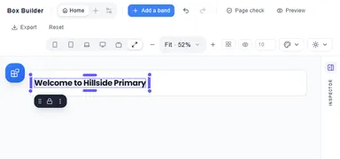](img/story-tablet-editor.webp)

**The bar at the top is one row, as on a phone.** It holds her pages, **Undo**, **Redo**, **Preview** and **⋯ More**, so
the page keeps the height of the screen. More rises from the bottom (no wider than 32rem, centred) with everything else:
the screen sizes, the zoom, the layout guides, the themes, Page check, Export and the rest.

**The desktop page is one tap away.** In More, **Desktop** draws the desktop page shrunk to fit the tablet, so she can
check it; **Tablet** (or **Laptop**) brings her own screen back at full size.

**She adds a block from a sheet.** The round **+** waits in the bottom-right corner. Tapped, the blocks rise from the
bottom, as on a phone, but no wider than 32rem (512 pixels) and centred, so they never stretch across the whole tablet.
**Add it** at the top says where the block goes (Before, After, Inside, Start or End); Back, Escape or the ✕ puts the
sheet away. Everything about it is told under "Building on a phone" below.

**The Inspector waits at the side.** On a tablet, upright or sideways, the Inspector is a narrow strip on the right edge
labelled **INSPECTOR**, so the page keeps the width of the screen. She taps its open button and it slides over the right
part of the canvas; **Escape** closes it. From a laptop's width (1024 pixels) it is docked beside the page instead. If she
opens or closes it herself, that holds until the next time the screen crosses that width.

[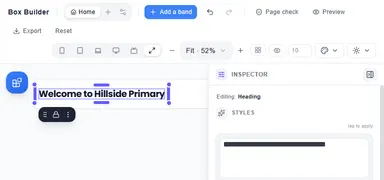](img/story-tablet-inspector.webp)

**A finger does everything a mouse does.** Tap to select; drag an edge's handle to size a block; hold a block still for
half a second to move it (told under "Building on a phone" below). As on a phone, the selected block's toolbar waits at the
bottom of the screen, under her thumb, so it never hides the block above the one she chose; for a block that floats it keeps
the grip, which she drags to move it. Whatever she drags, with a finger or a mouse,
the edge she holds is the only edge that moves.

**From a laptop's width (1024 pixels) up, Full width is the desktop page.** On a laptop or larger the editor opens at
Full width, which draws the page as it is on a desktop (1200px wide), shrunk to fit whatever room there is; the blocks
panel docks at the side and the page moves over to make room. To change how the page looks on a tablet or a phone from
there, she picks **Tablet** or **Mobile** at the top.

Every control in the Inspector is reachable by scrolling; Escape closes it.

### Building on a phone

Maya is on the bus with only her phone, and the head teacher wants the sports-day results on the site before lunch.

**The phone edits at its own width.** She opens the builder and the page fills her phone at its real size. It is the
**Mobile** screen, drawn 1:1, not the desktop page shrunk to a fifth of the width. The words are the size her visitors
will read them. What she changes in the layout here changes the phone only, and the desktop page is left as it was. Her
words, pictures and links are the same on every screen. (To look at the desktop page she chooses **Desktop** at the top.)

**The bar at the top is one row.** On a phone it holds only what Maya reaches for all the time: her pages, **Undo**,
**Redo**, **Preview** and **⋯ More**. More rises from the bottom with everything else: **Add page**, **Page settings**,
**Add a band**, **Page check**, **Export**, **Reset**, the screen sizes, the zoom, the layout guides and the themes, each
with its name beside its icon. Back, Escape or the ✕ puts it away, and the page keeps the rest of the screen.

**She adds a block from a sheet.** A round **+** waits in the bottom-right corner, where her thumb is. She taps the
results heading, then the **+**, and the blocks rise from the bottom of the screen. The sheet covers at most 60% of the
screen, so the page is still there above it. At its top, **Add it** reads **After**: a new block goes on a line of its
own just under the heading she selected. She could choose **Before**, **Inside** (for a box that holds blocks), **Start**
or **End** of the page instead. She taps **Stack**. The sheet closes and the new block is selected, so the next one she
adds goes after it. Back, Escape or the ✕ puts the sheet away without leaving the builder.

[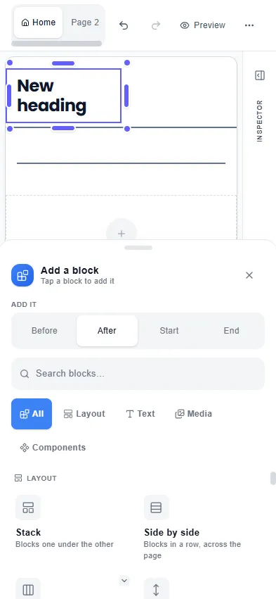](img/story-phone-sheet.webp)

**An empty box says where to add.** On a touch screen an empty box reads **Add block here — tap +**, and its **+** is a
finger's size.

**She moves blocks with arrows.** On a phone the selected block's toolbar waits at the bottom of the
screen, under her thumb, instead of hanging over the page, so it never covers the block below the one she chose. It has
**Move up** and **Move down**. A block
alone on its line moves the whole line one step down the page. A block sharing a line with others has **Move left** and
**Move right** instead. The ⋮ menu adds **Move to top** and **Move to bottom**. An arrow is greyed out when there is nowhere
to go, and Undo puts a move back. The same moves work from a keyboard: the arrow keys. The arrows are always there, so
nothing on the page ever needs a drag.

**…or she picks it up with her finger.** Maya holds her finger still on the results table for half a second. Her phone
gives a small tick, and the block lifts: a chip with its name rides just above her finger, where she can see it, and a
line on the page shows where it will land. She slides it up under the heading and lets go; it lands on the line. Near
the top or the bottom of the screen the page scrolls by itself, faster the nearer the edge, so a block can travel the
whole page. A quick tap still only selects, and a quick swipe still scrolls the page. Nothing is picked up by accident.
The **grip** at the start of the toolbar does the same without the wait: drag it and the block comes with it.

[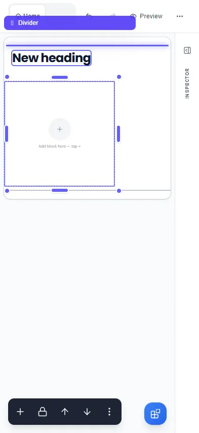](img/story-phone-lift.webp)

**Where it lands is easy to aim at.** Dropping near the top or the bottom of a block means above it or below it, and near
its sides means beside it. With a finger those strips are at least 44 pixels deep (on a small block, a third of it, so
"inside" stays reachable too); with a mouse they keep their narrower size.

**She sizes a block with her finger, or by choosing.** The round handles on a selected block's edges and corners can be
dragged with a finger exactly as with a mouse: the edge she holds follows her finger, the opposite edge stays put, and the
page does not scroll while she drags. On a touch screen each handle answers to a 44-pixel area just outside the
block's edge, even though it is drawn small, and a tap in the middle of the block is still the block's. Or, under **Width** in the Inspector: **Fit**, **Full**, **½**, **⅓** or **Custom**. On the phone, ½
makes the block half the line on phones only.

**Everything is a finger's size.** On a touch screen every button in the block toolbar, the sheet, the Inspector and its
menus is at least 44 × 44 pixels (WCAG's enhanced size, and Apple's). With a mouse the editor keeps its compact sizes.

**Every handle can be grabbed, however narrow the block.** The block's toolbar sits above the block, clear of the
round handles on its edges, so on a phone, where every block is drawn small, the top edge's handle is still there to
take hold of.

**A handle never hides the words under it.** On a phone a heading at the top of its section is drawn only a few pixels
tall, and once Maya has selected the section, its top handle lies right over that heading. A tap that doesn't move goes
through the handle: tapping the heading again selects the heading, just as it would anywhere else. Only a drag takes
hold of the handle.

**The shrunk page behaves exactly like the real one.** However small the page is drawn:

- A header set to **stay put while scrolling** stays at the top as Maya scrolls the canvas, and a bar pinned to the
  bottom stays at the bottom. Bars pinned at the same edge sit one under another, never on top of each other.
- A block set to **float on screen** stays exactly where she placed it, on the canvas and on the published page.
- Dragging an edge spends exactly what its neighbour can give. The stack above shrinks right down to its words, and the
  edge she is not holding never moves.
- Pull a block's side far enough past its neighbour and the neighbour moves down to the next line. Pull back and it
  returns. A small wobble at the end of a drag never does this.
- Dragging the same edge out and back, over and over, brings the page back to exactly where it was.

**The open Inspector lies over the right part of the canvas** (22rem of it). Nothing of the canvas — no handle, no
toolbar — is drawn over the Inspector, so every control in it can be reached; what lies behind it comes back when
she closes it.

---

## What comes next

The reference page ([Layout — reference](layout-reference)) lists every control in the Layout panels by its exact
name and what it does. The Website Builder Guide ([Website Builder](website-builder)) covers content blocks, media,
components, themes, Preview, and export.
